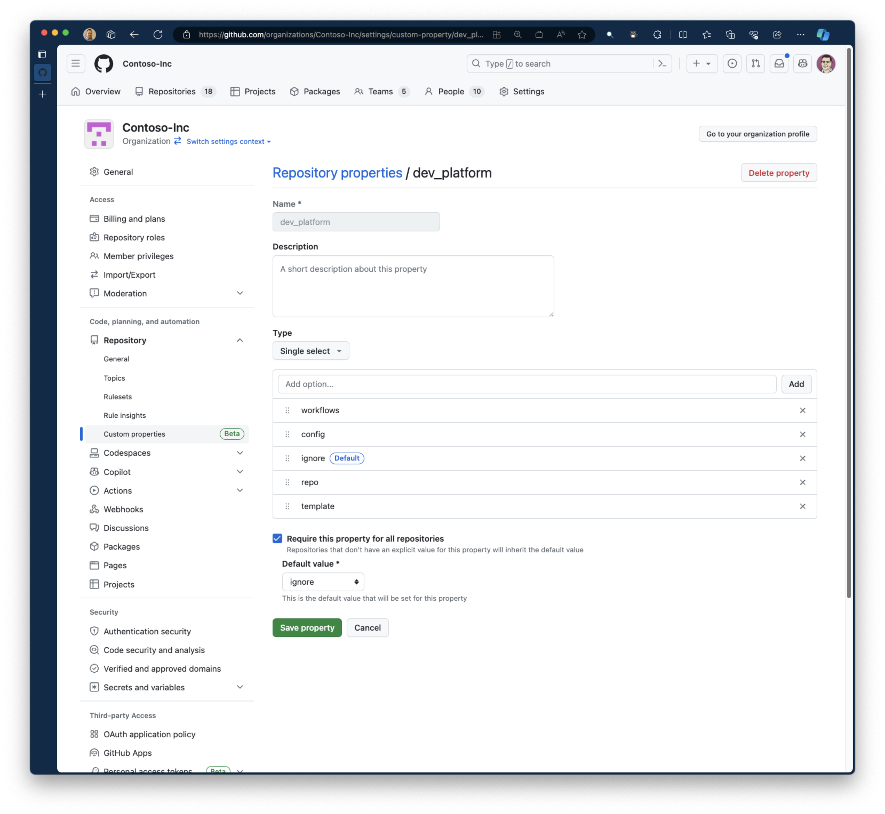

## Overview
Often, organizations with many developers, especially those that work in open source, want to ensure that all repositories are created in a manner that is consistent with their corporate guidelines. For example, each repository in the Microsoft organization must have two owners, a license, code scanning enabled, etc. While this seems like a simple thing--we've all created repos in our personal GitHub accounts--if it's not done properly, there could be lots of headaches down the road. So we have let the developer create repos when they need them (we don't want to slow a dev down just becuase they need a place to put their code) and we need to ensure that every repo created adheres to our standards.

This pattern is not unique to Microsoft. It turns out, enabling developers to self-service repository creation is one of the foundational patterns of platform engineering. And this is the role the GitHub provider fulfills in the developer foundation.

## GitHub App Implementation

The GitHub provider is implemented as a GitHub application and installed at the organization level, and because of this, it has access to the identity of the user, and by extension, has the same level of permissions, e.g. visibility. This is important because that enables the Internal Developer Portal to leverage the security controls inherent in GitHub and not have to "layer" additional permissions or security on top.
> 
> <sup>GitHub Apps page</sup>

### Provider Capabilities

A built in capability that it adds to the example “Contoso-Inc” internal developer platform (IDP) is the ability to create repositories. However, the real power of the GitHub provider is being able to inspect the repositories it is installed in, and based on a set of conventions, determine the artifacts, e.g. templates, it can contribute to the internal developer platform. 

#### Organization Repository Custom Properties
The GitHub provider uses `custom properties` as the mechanism to define the conventions it uses to drive contributions to the developer platform. 

> 
> <sup>Organization Repository Customer Properties page</sup>

Custom properties are defined at the organization level, and applied at the repository level. GitHub permissions restrict setting these properties to organizational owners. Therefore, if the GitHub organization is part of the platform engineering managed internal developer portal, then its repositories will be annotated with the proper custom properties. The table below are the currently defined properties:

|Property|Definition|
|----------|-----|
|config    | < TBD > |
|ignore    | The default setting indicating to the internal developer platform to ignore the repository  |
|repo      | This repository can be used as a template for the creation of other repos. (See: [python-mongo-aca](https://github.com/Contoso-Inc/python-mongo-aca)) |
|template  | < TBD > |
|workflows | The repository that has this custom properties will contribute automation workflows to the internal developer platform. (See: [example workflows repsitory](https://github.com/Contoso-Inc/workflows)) |


##### `workflows`

When a `dev_platform` custom property in a repository is annotated with the value of `workflows`, the GitHub provider treat the actions contained in `.github/workflows` folder as automation templates for use within the developer platform. As an example, see the [Contoso-Inc workflows repository](https://github.com/Contoso-Inc/workflows/tree/main/.github/workflows). When the the developer platform requests all of the entities from each provider, the GitHub provider responds with the set of github actions, represented as workflow templates, that are contained in this directory. Here is the how the developer platform represents the [`hello.yml` workflow](https://github.com/Contoso-Inc/workflows/blob/main/.github/workflows/hello.yml).

```json
 {
    "apiVersion": "developer.microsoft.com/v1",
    "kind": "Template",
    "metadata": {
      "name": "workflows-hello.yml",
      "namespace": "contoso-inc",
      "title": "Say Hello",
      "description": "This workflow is used to test the different input types. It simply says hello to the person you specify.",
      "labels": {
        "github.com/org": "Contoso-Inc",
        "github.com/repo": "workflows",
        "github.com/id": "70315432",
        "github.com/name": "Say Hello",
        "github.com/path": ".github/workflows/hello.yml",
        "github.com/workflow": "hello.yml"
      },
      "links": [
        {
          "url": "https://github.com/Contoso-Inc/workflows/blob/main/.github/workflows/hello.yml",
          "title": "web"
        },
        {
          "url": "https://github.com/Contoso-Inc/workflows",
          "title": "repo"
        }
      ],
      "provider": "github.com"
    },
    "spec": {
      "inputJsonSchema": "{\"type\":\"object\",\"required\":[\"name\",\"environment\"],\"properties\":{\"name\":{\"name\":\"name\",\"title\":\"Name\",\"type\":\"string\",\"description\":\"Who would you like to say hello to?\"},\"yell\":{\"name\":\"yell\",\"title\":\"Yell\",\"type\":\"boolean\",\"description\":\"Would you like to yell?\",\"default\":false,\"value\":false},\"environment\":{\"name\":\"environment\",\"title\":\"Environment\",\"type\":\"string\",\"description\":\"The GitHub Environment to deploy to\",\"default\":\"Dev\",\"value\":\"Dev\",\"enum\":[\"Dev\",\"Prod\",\"Staging\",\"Test\"]}}}"
    }
  }
```

This approach unlocks all of the actions in the [GitHub Marketplace](https://github.com/marketplace?category=&query=&type=actions&verification=). For example, suppose that you wanted to send a meesage via Microsoft Teams whenenver as part of a larger workflow, e.g. when the developer platform realizes a repository is out of compliance. In this scenario, the Platform Engineering Team can wrap an existing GitHub action for sending Teams messages. 

```json
  {
    "apiVersion": "developer.microsoft.com/v1",
    "kind": "Template",
    "metadata": {
      "name": "workflows-notify_team.yml",
      "namespace": "contoso-inc",
      "title": "NotifyTeam",
      "description": "Runs the NotifyTeam workflow.",
      "labels": {
        "github.com/org": "Contoso-Inc",
        "github.com/repo": "workflows",
        "github.com/id": "79561848",
        "github.com/name": "NotifyTeam",
        "github.com/path": ".github/workflows/notify_team.yml",
        "github.com/workflow": "notify_team.yml"
      },
      "links": [
        {
          "url": "https://github.com/Contoso-Inc/workflows/blob/main/.github/workflows/notify_team.yml",
          "title": "web"
        },
        {
          "url": "https://github.com/Contoso-Inc/workflows",
          "title": "repo"
        }
      ],
      "provider": "github.com"
    },
```

##### Using Workflows in the Developer Platform

For organizations that have a GitHub actions, being able to quickly add them into the developer platform is a great way to get started by leveraging existing investments. Since the developer platform is API driven, organizations that choose to build a portal/web interface, can quickly expose these actions in a UI, enabling the developer to discover all of the capabilities that they can use directly, or compose into their own templates for use with their project. 
> 
> <sup>Contoso Inc's [Mock Developer Portal](https://github.com/microsoft/developer-platform-website)</sup>

#### Copilot Integration

One key advantage of being API driven is that all of the workflows can now be used with Copilot. For example, there is a protype of a VS Code plugin that integrates the developer platform with Copilot. This enables the developer to leverage all of the workflows directly from their IDE. Here is an example of interacting with the developer platform from Copilot within VS Code. The workflow that was created above to send a message to Teams is discovered via the `@devplat /list` instruction to Copilot. 
> 
> <sup>Using Copilot with the Developer Platform</sup>

### Summary

The GitHub provider is an example of how easy it is to integrate with the developer platform. It enables the platform engineering team to leverage the security controls of GitHub, and the power of GitHub actions to quickly add capabilities to the developer platform. By adding a provider, developers can now interact with the developer platform in a consistent manner, regardless of the user interface they choose to use.


